# ChatFlow 后端架构详解

## 目录

- [整体请求链路](#整体请求链路)
- [LangGraph 图结构](#langgraph-图结构)
- [多模态输入](#多模态输入)
- [语义缓存（Semantic Cache）](#语义缓存semantic-cache)
- [asyncio 并发架构（核心优化）](#asyncio-并发架构核心优化)
- [SSE 事件处理链](#sse-事件处理链)
- [think-block 三层过滤](#think-block-三层过滤)
- [记忆系统](#记忆系统)
- [节点详解](#节点详解)
- [配置参考](#配置参考)
- [渐进式执行全流程示例（四步规划）](#渐进式执行全流程示例四步规划)

---

## 整体请求链路

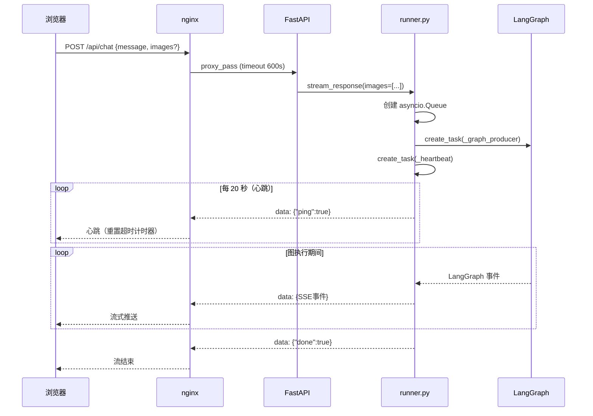

> **关键**：心跳每 20s 发一次，让 nginx 的 `proxy_read_timeout` 计时器持续重置。`<think>` 块被过滤不发送，否则长推理时间会导致 nginx 判定连接空闲而断流。

---

## LangGraph 图结构

### 完整图（ROUTER_ENABLED=true）


### 递归上限计算

`recursion_limit = 60`，支持最多 **13 个计划步骤**：

```
固定(5) + 每步(4) × 13步 = 57 ≤ 60
```

### chat / code 快速路径


---

## 多模态输入

支持图片 + 文字混合输入，全链路处理如下：

### 请求到 LLM

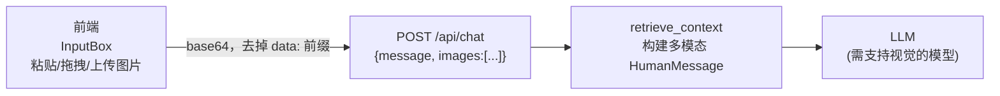

`retrieve_context` 构建的多模态消息格式（OpenAI 兼容）：
```json
[
  {"type": "image_url", "image_url": {"url": "data:image/jpeg;base64,..."}},
  {"type": "image_url", "image_url": {"url": "data:image/jpeg;base64,..."}},
  {"type": "text",      "text": "用户的文字消息"}
]
```

### 存储替换

base64 原始数据不存入数据库和记忆系统。`save_response` 在持久化前调用 LLM 生成图片描述，存储格式为：

```
{用户文字消息}
[用户上传了图片：图片内容大致为{AI描述，不超过50字}]
```

### 多模态与缓存的关系

- `semantic_cache_check`：含图片请求直接跳过缓存检查
- `save_response`：含图片的回复不写回缓存

> 支持的模型：MiniMax M2.7、GPT-4o、GLM-4V、Ollama LLaVA 等支持 `image_url` 格式的视觉模型。

---

## 语义缓存（Semantic Cache）

相同语义的问题直接命中缓存，**跳过整个 LLM 推理链路**，响应时间从秒级降至毫秒级。

### 缓存流程

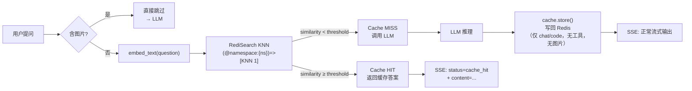

### 命名空间隔离（`SEMANTIC_CACHE_NAMESPACE_MODE`）

| 模式 | namespace 值 | 适用场景 |
|------|-------------|---------|
| `prompt`（默认）| `md5(system_prompt)[:8]` | 同 system_prompt 跨 session 共享，不同 prompt 隔离 |
| `global` | `"global"` | 所有对话完全共享，最大命中率 |
| `conv` | `conv_id` | 每个 session 独立，相当于禁用跨 session 共享 |

Redis key 格式：`cache:{namespace}:{md5(question)}`

### 不缓存的场景

- 含图片的请求（图片内容影响语义，且不参与向量匹配）
- `search` / `search_code` 路由（含实时数据）
- 含工具调用的响应
- 缓存命中的回复（避免二次写入）

### OOP 扩展接口

```
SemanticCache (ABC)          ← cache/base.py
├── RedisCacheBackend        ← cache/redis_cache.py（当前实现）
└── _NullCache               ← 禁用/降级时自动启用

CacheFactory.get_cache()     ← 全局单例入口
```

新增后端只需：继承 `SemanticCache`，实现 `init/lookup/store/clear`，在 `cache/factory.py` 的 `init_cache()` 中按配置选择实例化。

### 新增 SSE 事件

| 事件 | 含义 |
|------|------|
| `{"status": "cache_hit", "similarity": 0.92}` | 命中缓存，后续 content 来自缓存 |

---

## asyncio 并发架构（核心优化）

### 旧版 vs 新版对比

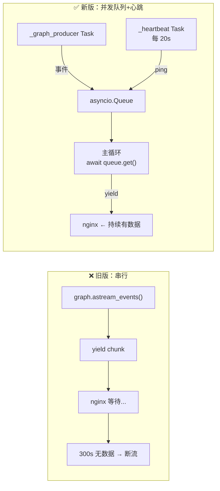

### stream_response 完整数据流

#### 阶段一：启动

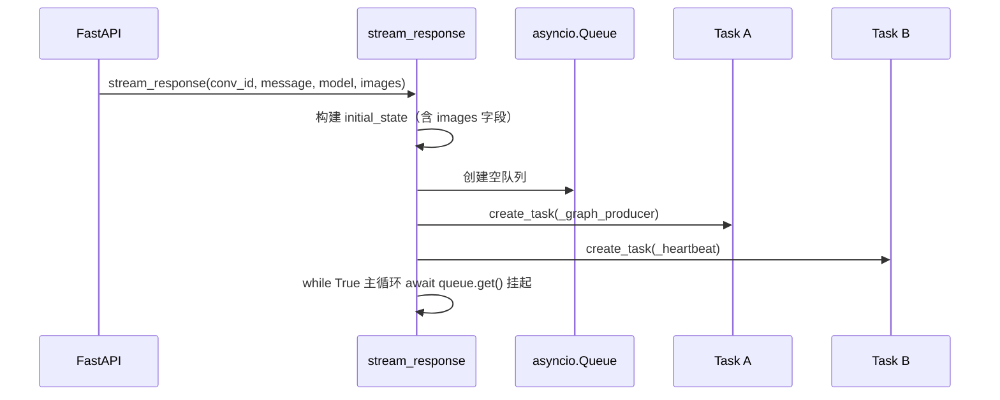

#### 阶段二：正常执行期间的数据流

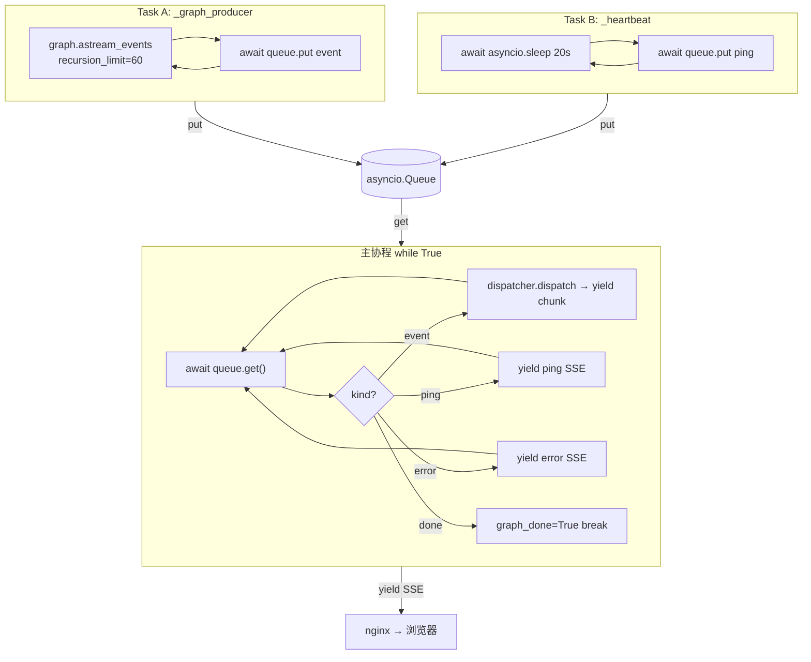

#### 阶段三：客户端断开时的清理

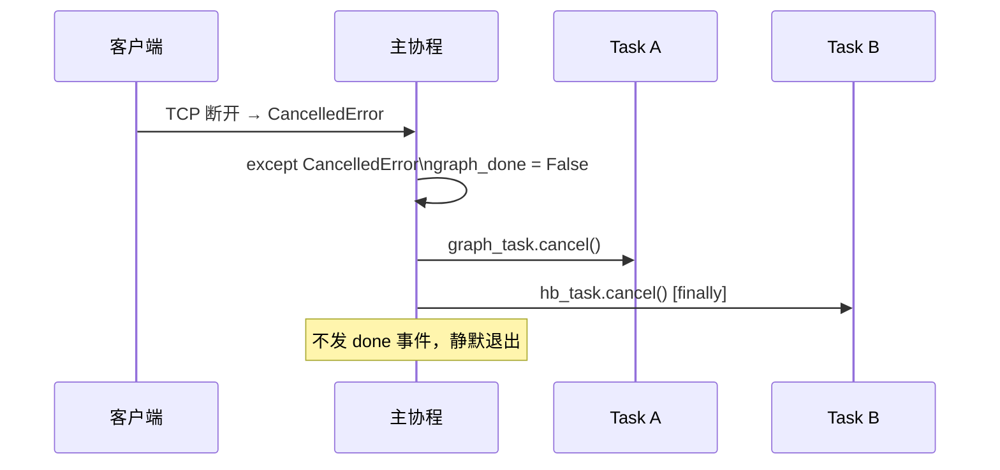

---

## SSE 事件处理链

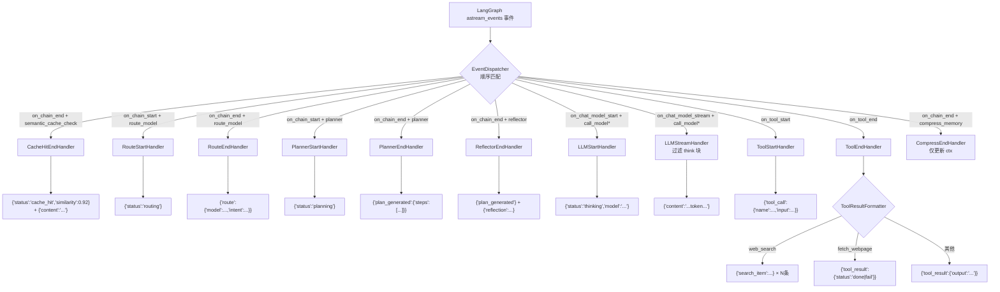

---

## think-block 三层过滤

qwen3 在 search/planning 模式下输出大量 `<think>...</think>` 推理内容，如果不过滤会破坏 markdown 代码块渲染。

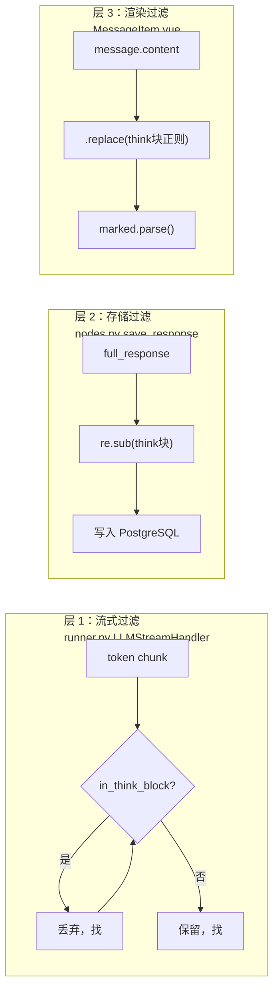

---

## 记忆系统

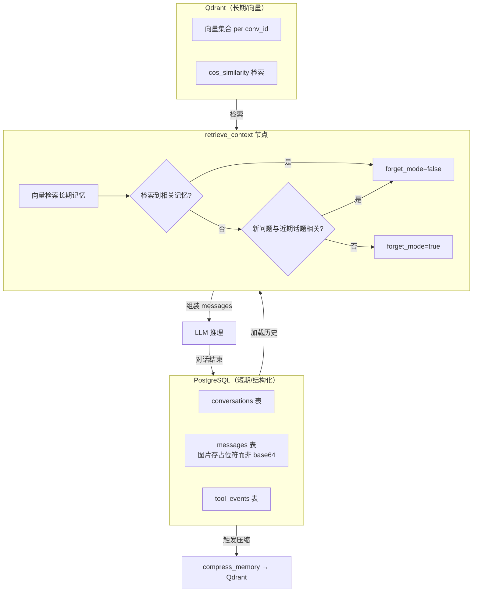

---

## 节点详解

### 路由决策表

| route | 触发场景 | tool_model | answer_model |
|---|---|---|---|
| `chat` | 通用聊天、推理、翻译、写作 | = answer_model | CHAT_MODEL |
| `code` | 纯代码编写/调试，需求明确 | = answer_model | CHAT_MODEL |
| `search` | 需联网查实时信息，不写代码 | SEARCH_MODEL | SEARCH_MODEL |
| `search_code` | 查文档/仓库后再写代码 | SEARCH_MODEL | CHAT_MODEL |

### reflector 决策逻辑

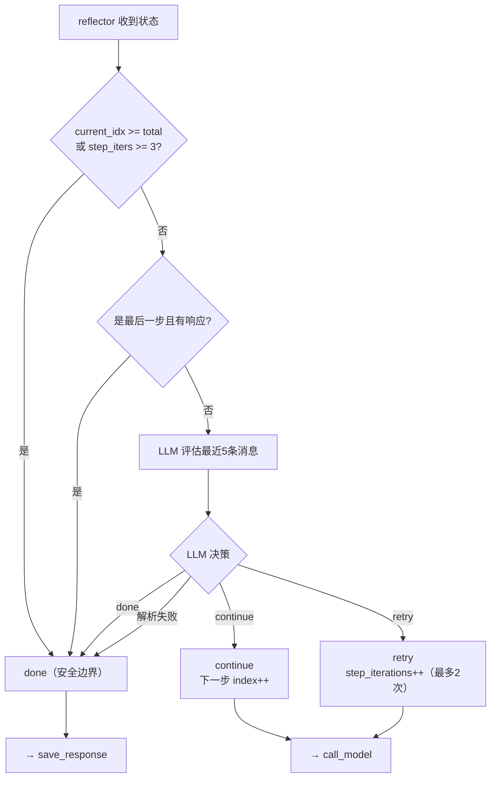

---

## 配置参考

| 环境变量 | 用途 |
|---|---|
| `LLM_BASE_URL` | LLM 服务地址（OpenAI 兼容，含 `/v1`） |
| `API_KEY` | LLM API Key |
| `EMBEDDING_BASE_URL` | Embedding 服务地址（独立配置，可与 LLM 不同提供商） |
| `CHAT_MODEL` | chat 路由 answer_model |
| `ROUTER_MODEL` | route_model 节点，temperature=0 |
| `SEARCH_MODEL` | search 路由 tool_model |
| `SUMMARY_MODEL` | compress_memory 摘要生成 |
| `EMBEDDING_MODEL` | Qdrant 向量化 + 语义缓存向量化 |
| `ROUTER_ENABLED` | 是否启用 route_model 节点 |
| `ROUTE_MODEL_MAP` | JSON，各路由类型对应模型 |
| `LONGTERM_MEMORY_ENABLED` | 是否启用 Qdrant 长期记忆 |
| `QDRANT_URL` | Qdrant 地址 |
| `SEMANTIC_CACHE_ENABLED` | 是否启用语义缓存 |
| `REDIS_URL` | Redis 连接串 |
| `SEMANTIC_CACHE_INDEX` | RediSearch 索引名 |
| `SEMANTIC_CACHE_THRESHOLD` | 命中相似度阈值（0-1，推荐 0.85~0.92） |
| `SEMANTIC_CACHE_NAMESPACE_MODE` | 命名空间模式：`prompt` / `global` / `conv` |
| `SHORT_TERM_MAX_TURNS` | 短期记忆保留轮数 |
| `COMPRESS_TRIGGER` | 触发压缩的消息条数 |
| `recursion_limit` | 60（硬编码），支持最多 13 步计划 |

---

## 渐进式执行全流程示例（四步规划）

> **场景**：用户提问「帮我整理一份关于中国人工智能发展的网页报告」
>
> route → `search_code`，规划出 4 个步骤，依次渐进执行，最后生成完整 HTML 页面。

---

### 总览：节点执行序列

```
semantic_cache_check → route_model → retrieve_context → planner
  → call_model(步骤1) → tools → call_model_after_tool(步骤1) → reflector
  → call_model(步骤2) → tools → call_model_after_tool(步骤2) → reflector
  → call_model(步骤3) → tools → call_model_after_tool(步骤3) → reflector
  → call_model(步骤4，末步流式) → reflector
  → save_response → compress_memory → END
```

每步循环消耗 4 个 LangGraph 节点（call_model / tools / call_model_after_tool / reflector），4 步合计 16 个节点 + 固定开销 5 个 = 21，远低于 `recursion_limit=60`。

---

### 阶段 0：请求入口

```
浏览器 POST /api/chat  { conv_id, message: "帮我整理一份关于中国人工智能发展的网页报告" }
  ↓
nginx (proxy_read_timeout 600s)
  ↓
FastAPI stream_response()
  ├─ 创建 asyncio.Queue
  ├─ create_task(_graph_producer)   # 驱动 LangGraph astream_events
  └─ create_task(_heartbeat)        # 每 20s 向队列推 ping，维持 nginx 心跳
```

**initial_state（GraphState 初始值）**

```python
{
  "conv_id":            "abc-123",
  "user_message":       "帮我整理一份关于中国人工智能发展的网页报告",
  "model":              "qwen3-235b",
  "temperature":        0.7,
  "images":             [],
  "messages":           [],        # retrieve_context 填充
  "plan":               [],        # planner 填充
  "plan_id":            "",        # planner 填充（多步才有）
  "current_step_index": 0,
  "step_iterations":    0,
  "full_response":      "",
  "route":              "",
  "tool_model":         "",
  "answer_model":       "",
}
```

---

### 阶段 1：语义缓存检查（semantic_cache_check）

- 向 Redis 查询嵌入向量最近邻（KNN），similarity < threshold → **cache MISS**
- 含搜索意图的请求即使命中也不走缓存（节点后续会判断 route）

**SSE 推送**：无（MISS 不推送任何事件）

---

### 阶段 2：意图路由（route_model）

- 路由模型以 temperature=0 判断：需联网 + 最终生成代码 → `search_code`
- 分配模型：`tool_model = SEARCH_MODEL`（搜索阶段），`answer_model = CHAT_MODEL`（生成阶段）

**GraphState 更新**

```python
route        = "search_code"
tool_model   = "qwen3-235b"       # 搜索工具调用模型
answer_model = "qwen3-235b"       # 末步生成模型（可配置为更强模型）
```

**SSE 推送**

```json
{ "status": "routing" }
{ "route": { "model": "qwen3-235b", "intent": "search_code" } }
```

---

### 阶段 3：上下文检索（retrieve_context）

调用 `context_builder.build_messages()` 组装三层记忆：

**三层记忆作用（此阶段是唯一生效点）**

| 层级 | 数据源 | 内容 | 是否进入多步上下文 |
|------|--------|------|--------------------|
| 短期记忆 | PostgreSQL `messages` 表 | 最近 N 轮对话（HumanMessage / AIMessage） | ✅ 仅步骤 0 |
| 中期摘要 | PostgreSQL `conversations.mid_term_summary` | 更早对话的压缩摘要，注入 SystemMessage | ✅ 仅步骤 0 |
| 长期记忆 | Qdrant 向量检索 | 余弦相似度最高的历史片段 | ✅ 仅步骤 0 |

> ⚠️ 关键设计：三层记忆**只在步骤 0 的 call_model 里生效**。
> 步骤 1+ 切换到聚焦上下文（`_build_focused_step_messages`），完全不含历史对话，
> 防止历史噪声干扰中间步骤的工具调用判断。

**state["messages"] 组装结果（步骤 0 的完整上下文）**

```
[SystemMessage]
  "你是 ChatFlow 智能助手。当前日期：2026年04月07日。
   【对话背景摘要】上次我们讨论过 XX... （中期摘要，若有）
   【长期记忆】相关历史：... （Qdrant 检索结果，若有）"

[HumanMessage] "（上上轮）..."   ← 短期滑动窗口历史（若有）
[AIMessage]    "（上上轮回复）..."
[HumanMessage] "（上轮）..."
[AIMessage]    "（上轮回复）..."
[HumanMessage] "帮我整理一份关于中国人工智能发展的网页报告"  ← 本轮用户消息
```

**SSE 推送**：无

---

### 阶段 4：任务规划（planner）

调用规划 LLM（SEARCH_MODEL），生成结构化计划：

**LLM 输入**

```
system: "你是一个任务规划专家。当前日期：2026年04月07日 ..."
user:   "帮我整理一份关于中国人工智能发展的网页报告"
```

**LLM 输出**

```json
{
  "steps": [
    { "title": "搜索AI发展现状", "description": "搜索中国AI技术现状、主要企业和应用领域" },
    { "title": "搜索政策与数据", "description": "搜索国家AI政策文件、投资规模和增长数据" },
    { "title": "搜索典型案例",   "description": "搜索具体的AI应用成功案例和行业落地情况" },
    { "title": "生成网页报告",   "description": "基于以上信息生成完整的 HTML 网页报告" }
  ]
}
```

**GraphState 更新**

```python
plan = [
  { "id":"1", "title":"搜索AI发展现状", "description":"...", "status":"running", "result":"" },
  { "id":"2", "title":"搜索政策与数据", "description":"...", "status":"pending", "result":"" },
  { "id":"3", "title":"搜索典型案例",   "description":"...", "status":"pending", "result":"" },
  { "id":"4", "title":"生成网页报告",   "description":"...", "status":"pending", "result":"" },
]
plan_id            = "f7a3c1d2-..."   # 仅多步时生成
current_step_index = 0
step_iterations    = 0
```

**DB 写入（plan_steps 表）**

```sql
INSERT INTO plan_steps (id, conv_id, goal, steps, current_step, total_steps, ...)
VALUES ('f7a3c1d2-...', 'abc-123', '帮我整理...', '[{"id":"1",...},...]', 0, 4, ...)
```

**SSE 推送**

```json
{ "status": "planning" }
{ "plan_generated": { "steps": [ {"title":"搜索AI发展现状","status":"running"}, ... ] } }
```

---

### 阶段 5：步骤 1 执行（搜索 AI 发展现状）

#### 5-A. call_model（步骤 0，工具调用）

`current_step_index = 0`，使用 `state["messages"]`（三层记忆上下文），追加步骤指令：

**实际发送给 LLM 的消息**

```
[SystemMessage]  "你是 ChatFlow 智能助手。当前日期：... 【长期记忆】..."

[HumanMessage]   "（历史对话，若有）"
...
[HumanMessage]   "帮我整理一份关于中国人工智能发展的网页报告
                  ---
                  **[执行步骤 1/4]: 搜索AI发展现状**
                  具体任务：搜索中国AI技术现状、主要企业和应用领域
                  请使用工具完成此步骤，收集所需信息。"
```

**LLM 返回** `tool_calls: [web_search("中国人工智能发展现状 2024 主要企业")]`

**GraphState 更新**：`messages += [AIMessage(tool_calls=[...])]`

**SSE 推送**：`{"status":"thinking","model":"qwen3-235b"}` + `{"tool_call":{"name":"web_search","input":{...}}}`

#### 5-B. tools（执行搜索）

**GraphState 更新**：`messages += [ToolMessage(搜索结果 JSON)]`

**SSE 推送**：`{"search_item":{"title":"...","url":"...","snippet":"..."}}` × N 条

#### 5-C. call_model_after_tool（步骤 0，综合工具结果）

`is_last = False` → `_build_focused_step_messages()` **完全替换**消息集：

**实际发送给 LLM 的消息**

```
[SystemMessage]  "你是一个信息采集助手。请根据工具返回的结果，
                  简洁总结步骤'搜索AI发展现状'的执行情况（约100-300字）。
                  ⚠️ 严格限制：只输出本步骤收集到的关键信息摘要；
                  不得生成HTML代码、完整文章、最终产品..."

[HumanMessage]   "当前步骤任务：搜索中国AI技术现状...
                  本步已调用工具 1 次，请分析工具结果并给出本步骤的信息摘要。"

[AIMessage]      （含 tool_calls 的原始 AI 消息）

[ToolMessage]    "{'results': [{'title':'中国AI...','snippet':'...'},...] }"
```

> 模型此时**看不到**「帮我做网页报告」，只能输出本步骤的信息摘要。

**LLM 输出**：「中国AI发展现状摘要：2024年中国AI市场规模达X千亿，百度、华为、阿里等企业...主要应用于智能制造、医疗影像...」

**GraphState 更新**：`messages += [AIMessage(摘要)]`，`full_response = "中国AI发展现状摘要：..."`

**SSE 推送**：`{"content":"中"}` `{"content":"国"}` ... （逐 token 流式）

#### 5-D. reflector（步骤 0 完成）

**快速路径 2**：`not is_last` + `has ToolMessage` + `step_iters == 0` → **跳过 LLM 评估，直接 continue**

**GraphState 更新**

```python
plan[0] = { ..., "status": "done", "result": "中国AI发展现状摘要：..." }
plan[1] = { ..., "status": "running" }
current_step_index = 1
step_iterations    = 0
messages += [HumanMessage("步骤 1 已完成。\n\n**[执行步骤 2/4]: 搜索政策与数据**\n...")]
```

**DB 写入**

```sql
UPDATE plan_steps
SET steps = '[{"id":"1","status":"done","result":"中国AI发展..."},{"id":"2",...},...]',
    current_step = 1, updated_at = ...
WHERE id = 'f7a3c1d2-...'
```

**SSE 推送**：`{"plan_generated": {"steps":[{step1 done},{step2 running},...]}}`（前端更新进度条）

---

### 阶段 6：步骤 2 执行（搜索政策与数据）

#### 6-A. call_model（步骤 1，聚焦上下文）

`current_step_index = 1 > 0` → `_build_focused_step_messages()` 构建完全隔离的上下文：

**实际发送给 LLM 的消息**

```
[SystemMessage]  "你是一个专注的任务执行助手，负责完成多步骤任务中的当前步骤。
                  每次只完成当前步骤的任务，使用工具收集所需信息，
                  不要提前生成后续步骤的内容或最终产品。"

[HumanMessage]   "任务总目标：帮我整理一份关于中国人工智能发展的网页报告"

[AIMessage]      "【步骤1：搜索AI发展现状的执行结果】
                  中国AI发展现状摘要：2024年中国AI市场规模达X千亿..."

[HumanMessage]   "---
                  **[执行步骤 2/4]: 搜索政策与数据**
                  具体任务：搜索国家AI政策文件、投资规模和增长数据
                  请使用工具完成此步骤，收集所需信息。"
```

> 完全不含原始对话历史、中期摘要、长期记忆——上下文是**确定性的、可复现的**。

**LLM 返回** `tool_calls: [web_search("中国AI政策 新一代AI发展规划 投资数据")]`

步骤 2 的 tools → call_model_after_tool → reflector 流程与步骤 1 完全对称，此处略。

**reflector 后 GraphState 关键状态**

```python
plan[1] = { "status": "done", "result": "政策摘要：《新一代AI发展规划》明确2030年目标..." }
plan[2] = { "status": "running" }
current_step_index = 2
```

---

### 阶段 7：步骤 3 执行（搜索典型案例）

步骤 3 结构与步骤 2 完全对称。

call_model 聚焦消息新增步骤 2 的结果摘要：

```
[AIMessage]  "【步骤1：搜索AI发展现状的执行结果】\n中国AI发展现状摘要：..."
[AIMessage]  "【步骤2：搜索政策与数据的执行结果】\n政策摘要：..."
[HumanMessage] "---\n**[执行步骤 3/4]: 搜索典型案例**\n..."
```

**reflector 后 GraphState 关键状态**

```python
plan[2] = { "status": "done", "result": "案例摘要：华为盘古大模型在医疗...，百度文心在教育..." }
plan[3] = { "status": "running" }
current_step_index = 3
```

---

### 阶段 8：步骤 4 执行（末步：生成网页报告）

#### 8-A. call_model（步骤 3，末步，禁用工具，流式）

`current_idx = 3 = len(plan) - 1` → `is_last = True`，`use_tools = False`（末步强制禁工具，走流式路径）

`_build_focused_step_messages()` 末步分支：使用**对话自定义系统提示**（保持人格一致）：

**实际发送给 LLM 的消息**

```
[SystemMessage]  "你是 ChatFlow 智能助手。..."   ← 对话的 custom system_prompt

[HumanMessage]   "任务总目标：帮我整理一份关于中国人工智能发展的网页报告"

[AIMessage]      "【步骤1：搜索AI发展现状的执行结果】
                  中国AI发展现状摘要：..."

[AIMessage]      "【步骤2：搜索政策与数据的执行结果】
                  政策摘要：《新一代AI发展规划》..."

[AIMessage]      "【步骤3：搜索典型案例的执行结果】
                  案例摘要：华为盘古大模型..."

[HumanMessage]   "请基于以上所有步骤的执行结果，完成最终任务：
                  基于以上信息生成完整的 HTML 网页报告"
```

**LLM 流式输出**：`<!DOCTYPE html><html>...<h1>中国人工智能发展报告</h1>...</html>`

**SSE 推送**：逐 token `{"content":"<"}` `{"content":"!"}` ... （前端实时渲染）

#### 8-B. reflector（末步）

**快速路径 1**：`is_last == True` + `full_response 非空` → **直接 done，跳过 LLM**

**DB 写入**

```sql
UPDATE plan_steps
SET steps = '[..., {"id":"4","status":"done","result":"<!DOCTYPE html>...（截断3000字符）"}]',
    current_step = 4, updated_at = ...
WHERE id = 'f7a3c1d2-...'
```

**SSE 推送**：`{"reflection":"最后步骤执行完成"}` + `{"plan_generated":{全部步骤 done}}`

---

### 阶段 9：持久化与压缩（save_response + compress_memory）

**save_response**

- 将完整对话写入 PostgreSQL `messages` 表
- HTML 内容直接存储（不含图片 base64）
- 工具调用摘要写入 `tool_events` 表

**compress_memory**（按需触发）

- 若 `len(conv.messages) - mid_term_cursor >= COMPRESS_TRIGGER * 2`
- 调用 SUMMARY_MODEL 生成摘要，写回 `conversations.mid_term_summary`
- 将旧消息向量化后写入 Qdrant，供下次检索

**SSE 推送**：`{"done": true}` → 前端关闭 SSE 连接

---

### 数据走向总图

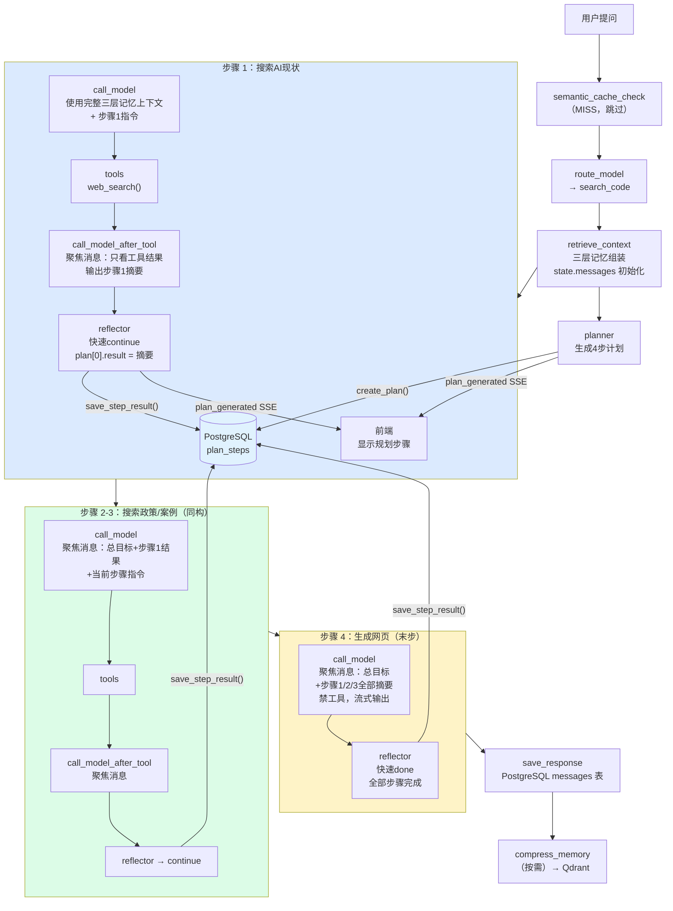

---

### GraphState 关键字段变化追踪

| 时刻 | `current_step_index` | `step_iterations` | `plan[i].status` | `plan[i].result` |
|------|----------------------|-------------------|------------------|------------------|
| planner 后 | 0 | 0 | 全部 pending（step0=running） | 全部 "" |
| step1 reflector 后 | 1 | 0 | step0=done, step1=running | step0="AI发展摘要…" |
| step2 reflector 后 | 2 | 0 | step0-1=done, step2=running | step0-1 各有摘要 |
| step3 reflector 后 | 3 | 0 | step0-2=done, step3=running | step0-2 各有摘要 |
| step4 reflector 后 | 4 | 0 | 全部 done | step3="<!DOCTYPE html>…" |

---

### 各步骤实际喂给模型的消息对比

| 步骤 | 节点 | 上下文来源 | 包含三层记忆 | 包含历史对话 | 上下文规模 |
|------|------|-----------|:-----------:|:-----------:|-----------|
| 步骤0 | call_model | state["messages"]（三层记忆全量） | ✅ | ✅ | 完整 |
| 步骤0 | call_model_after_tool | _build_focused（工具结果隔离） | ❌ | ❌ | 极小（3-5条） |
| 步骤1-2 | call_model | _build_focused（前步摘要累积） | ❌ | ❌ | 小（2+N条） |
| 步骤1-2 | call_model_after_tool | _build_focused（当步工具结果） | ❌ | ❌ | 极小（3-5条） |
| 步骤3（末步） | call_model | _build_focused（全部摘要+目标） | ❌ | ❌ | 中（2+3+1条） |

> **三层记忆的边界**：三层记忆（短期/中期/长期）只在步骤 0 的 `call_model` 调用中生效，
> 为模型提供「这个用户是谁、之前聊过什么」的背景。中间步骤切换为聚焦执行者角色，
> 从 `GraphState.plan[i].result`（运行时内存）读取前步摘要，不依赖历史积累。
