# ChatFlow 后端架构详解

## 目录

- [整体请求链路](#整体请求链路)
- [LangGraph 图结构](#langgraph-图结构)
- [多模态输入](#多模态输入)
- [语义缓存（Semantic Cache）](#语义缓存semantic-cache)
- [asyncio 并发架构（核心优化）](#asyncio-并发架构核心优化)
- [SSE 事件处理链](#sse-事件处理链)
- [think-block 三层过滤](#think-block-三层过滤)
- [记忆系统](#记忆系统)
- [节点详解](#节点详解)
- [配置参考](#配置参考)

---

## 整体请求链路

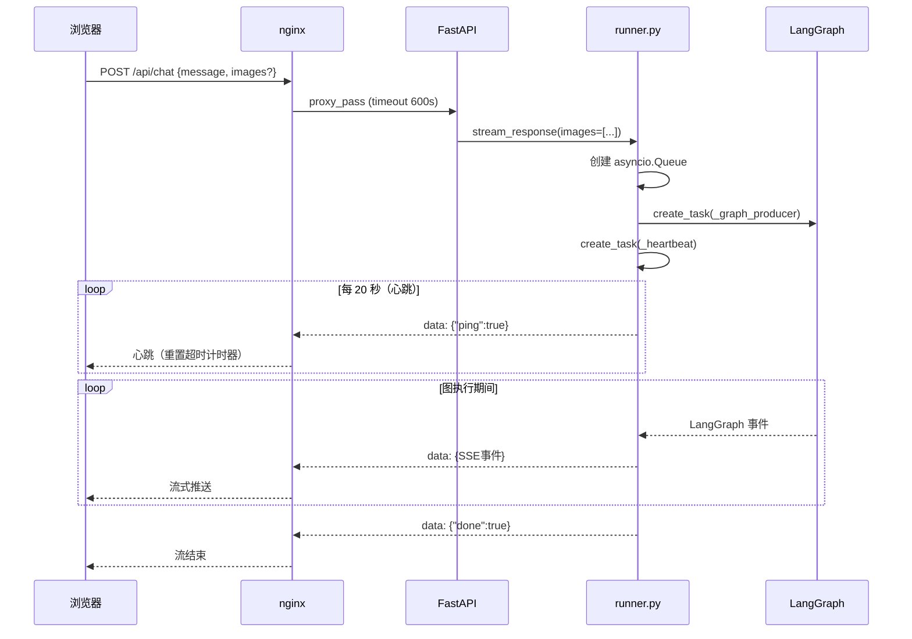

> **关键**：心跳每 20s 发一次，让 nginx 的 `proxy_read_timeout` 计时器持续重置。`<think>` 块被过滤不发送，否则长推理时间会导致 nginx 判定连接空闲而断流。

---

## LangGraph 图结构

### 完整图（ROUTER_ENABLED=true）

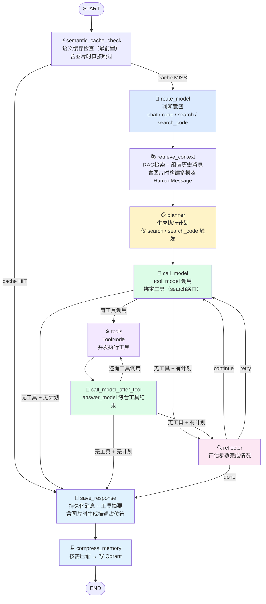

### 递归上限计算

`recursion_limit = 60`，支持最多 **13 个计划步骤**：

```
固定(5) + 每步(4) × 13步 = 57 ≤ 60
```

### chat / code 快速路径

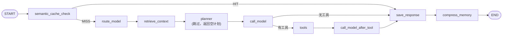

---

## 多模态输入

支持图片 + 文字混合输入，全链路处理如下：

### 请求到 LLM

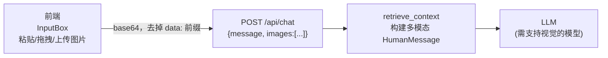

`retrieve_context` 构建的多模态消息格式（OpenAI 兼容）：
```json
[
  {"type": "image_url", "image_url": {"url": "data:image/jpeg;base64,..."}},
  {"type": "image_url", "image_url": {"url": "data:image/jpeg;base64,..."}},
  {"type": "text",      "text": "用户的文字消息"}
]
```

### 存储替换

base64 原始数据不存入数据库和记忆系统。`save_response` 在持久化前调用 LLM 生成图片描述，存储格式为：

```
{用户文字消息}
[用户上传了图片：图片内容大致为{AI描述，不超过50字}]
```

### 多模态与缓存的关系

- `semantic_cache_check`：含图片请求直接跳过缓存检查
- `save_response`：含图片的回复不写回缓存

> 支持的模型：MiniMax M2.7、GPT-4o、GLM-4V、Ollama LLaVA 等支持 `image_url` 格式的视觉模型。

---

## 语义缓存（Semantic Cache）

相同语义的问题直接命中缓存，**跳过整个 LLM 推理链路**，响应时间从秒级降至毫秒级。

### 缓存流程

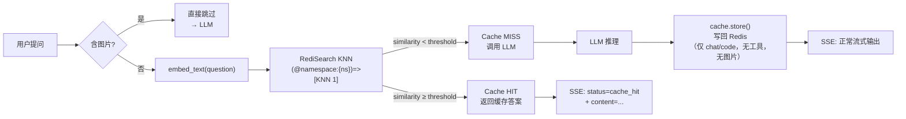

### 命名空间隔离（`SEMANTIC_CACHE_NAMESPACE_MODE`）

| 模式 | namespace 值 | 适用场景 |
|------|-------------|---------|
| `prompt`（默认）| `md5(system_prompt)[:8]` | 同 system_prompt 跨 session 共享，不同 prompt 隔离 |
| `global` | `"global"` | 所有对话完全共享，最大命中率 |
| `conv` | `conv_id` | 每个 session 独立，相当于禁用跨 session 共享 |

Redis key 格式：`cache:{namespace}:{md5(question)}`

### 不缓存的场景

- 含图片的请求（图片内容影响语义，且不参与向量匹配）
- `search` / `search_code` 路由（含实时数据）
- 含工具调用的响应
- 缓存命中的回复（避免二次写入）

### OOP 扩展接口

```
SemanticCache (ABC)          ← cache/base.py
├── RedisCacheBackend        ← cache/redis_cache.py（当前实现）
└── _NullCache               ← 禁用/降级时自动启用

CacheFactory.get_cache()     ← 全局单例入口
```

新增后端只需：继承 `SemanticCache`，实现 `init/lookup/store/clear`，在 `cache/factory.py` 的 `init_cache()` 中按配置选择实例化。

### 新增 SSE 事件

| 事件 | 含义 |
|------|------|
| `{"status": "cache_hit", "similarity": 0.92}` | 命中缓存，后续 content 来自缓存 |

---

## asyncio 并发架构（核心优化）

### 旧版 vs 新版对比

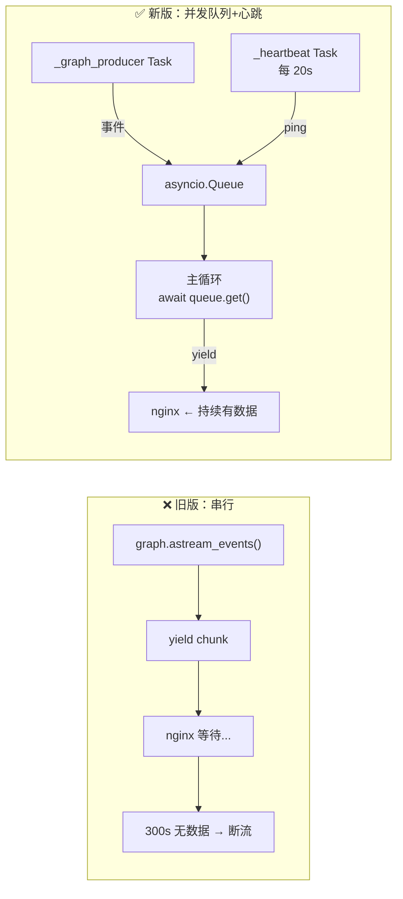

### stream_response 完整数据流

#### 阶段一：启动

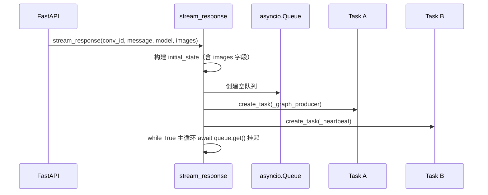

#### 阶段二：正常执行期间的数据流

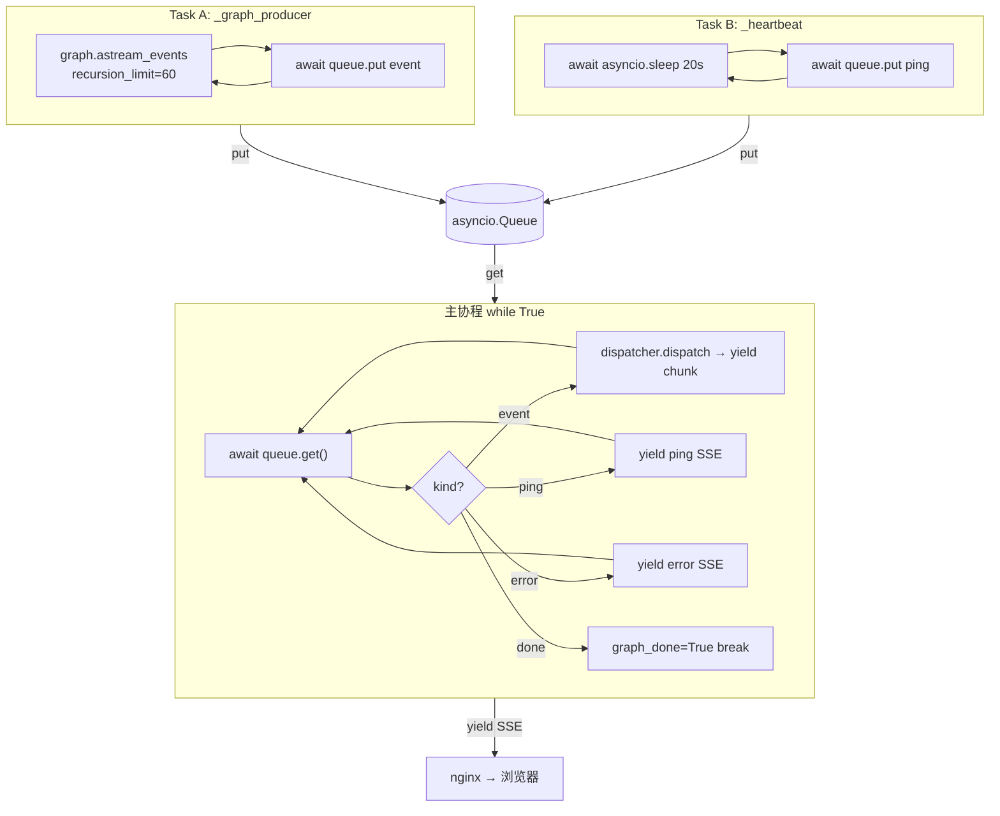

#### 阶段三：客户端断开时的清理

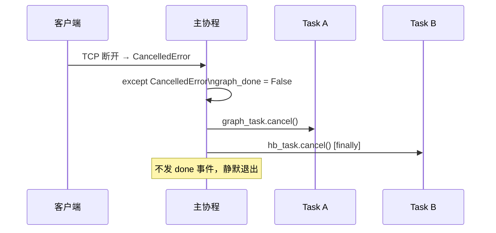

---

## SSE 事件处理链

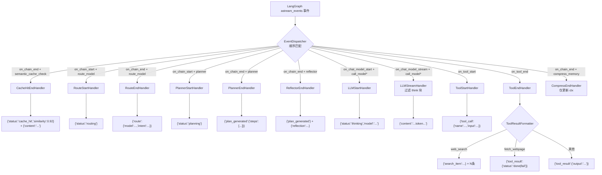

---

## think-block 三层过滤

qwen3 在 search/planning 模式下输出大量 `<think>...</think>` 推理内容，如果不过滤会破坏 markdown 代码块渲染。

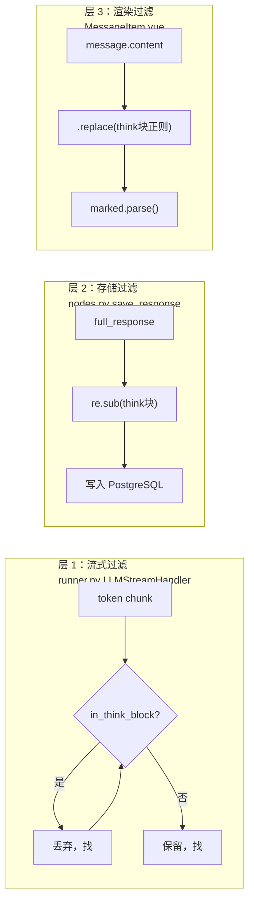

---

## 记忆系统

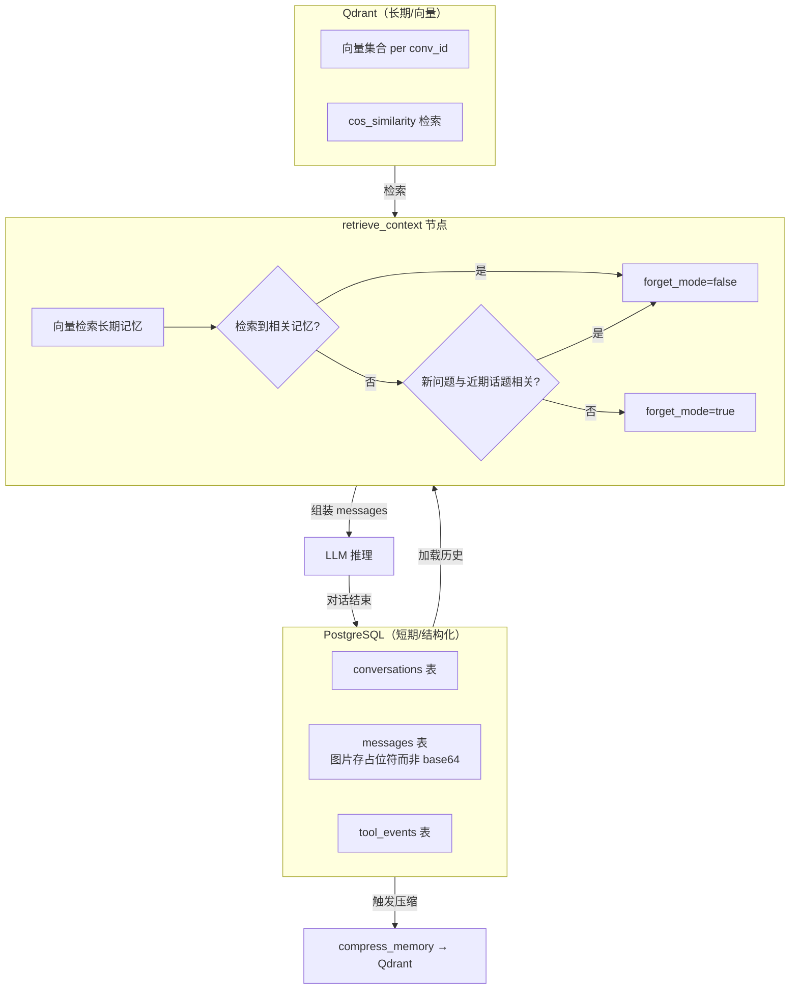

---

## 节点详解

### 路由决策表

| route | 触发场景 | tool_model | answer_model |
|---|---|---|---|
| `chat` | 通用聊天、推理、翻译、写作 | = answer_model | CHAT_MODEL |
| `code` | 纯代码编写/调试，需求明确 | = answer_model | CHAT_MODEL |
| `search` | 需联网查实时信息，不写代码 | SEARCH_MODEL | SEARCH_MODEL |
| `search_code` | 查文档/仓库后再写代码 | SEARCH_MODEL | CHAT_MODEL |

### reflector 决策逻辑


---

## 配置参考

| 环境变量 | 用途 |
|---|---|
| `LLM_BASE_URL` | LLM 服务地址（OpenAI 兼容，含 `/v1`） |
| `API_KEY` | LLM API Key |
| `EMBEDDING_BASE_URL` | Embedding 服务地址（独立配置，可与 LLM 不同提供商） |
| `CHAT_MODEL` | chat 路由 answer_model |
| `ROUTER_MODEL` | route_model 节点，temperature=0 |
| `SEARCH_MODEL` | search 路由 tool_model |
| `SUMMARY_MODEL` | compress_memory 摘要生成 |
| `EMBEDDING_MODEL` | Qdrant 向量化 + 语义缓存向量化 |
| `ROUTER_ENABLED` | 是否启用 route_model 节点 |
| `ROUTE_MODEL_MAP` | JSON，各路由类型对应模型 |
| `LONGTERM_MEMORY_ENABLED` | 是否启用 Qdrant 长期记忆 |
| `QDRANT_URL` | Qdrant 地址 |
| `SEMANTIC_CACHE_ENABLED` | 是否启用语义缓存 |
| `REDIS_URL` | Redis 连接串 |
| `SEMANTIC_CACHE_INDEX` | RediSearch 索引名 |
| `SEMANTIC_CACHE_THRESHOLD` | 命中相似度阈值（0-1，推荐 0.85~0.92） |
| `SEMANTIC_CACHE_NAMESPACE_MODE` | 命名空间模式：`prompt` / `global` / `conv` |
| `SHORT_TERM_MAX_TURNS` | 短期记忆保留轮数 |
| `COMPRESS_TRIGGER` | 触发压缩的消息条数 |
| `recursion_limit` | 60（硬编码），支持最多 13 步计划 |
