# ChatFlow 后端架构详解

## 目录

- [整体请求链路](#整体请求链路)
- [LangGraph 图结构](#langgraph-图结构)
- [asyncio 并发架构（核心优化）](#asyncio-并发架构核心优化)
- [SSE 事件处理链](#sse-事件处理链)
- [think-block 三层过滤](#think-block-三层过滤)
- [记忆系统](#记忆系统)
- [节点详解](#节点详解)
- [配置参考](#配置参考)

---

## 整体请求链路

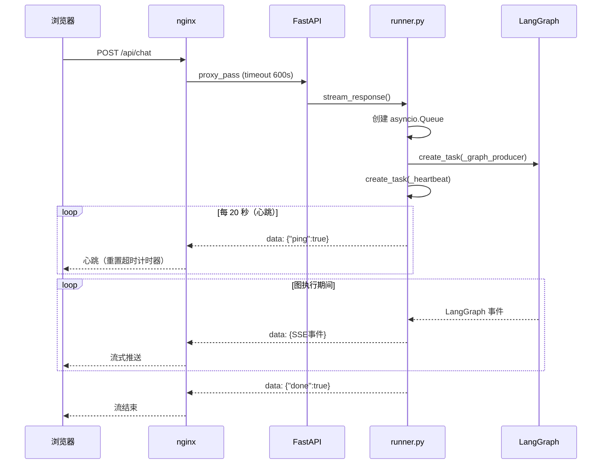

> **关键**：心跳每 20s 发一次，让 nginx 的 `proxy_read_timeout` 计时器持续重置。qwen3 推理时 `<think>` 块被过滤不发送，否则长推理时间会导致 nginx 判定连接空闲而断流。

---

## LangGraph 图结构

### 完整图（ROUTER_ENABLED=true）

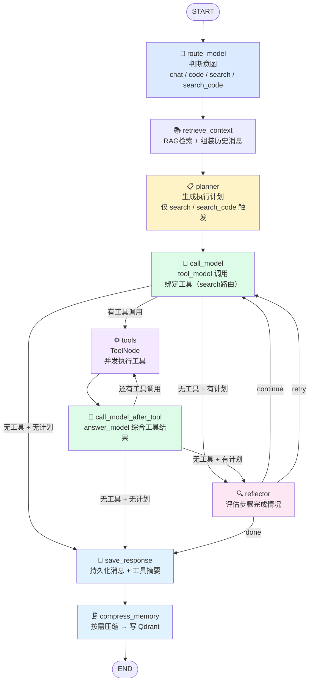

### 递归上限计算

`recursion_limit = 60`，支持最多 **13 个计划步骤**：

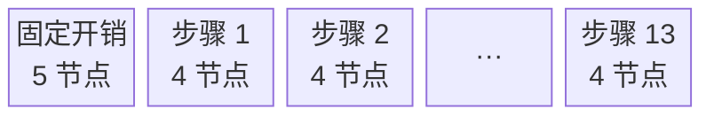

> `固定(5) + 每步(4) × 13步 = 57 ≤ 60`  旧版默认 25，3 步计划就可能撞墙。

### chat / code 快速路径

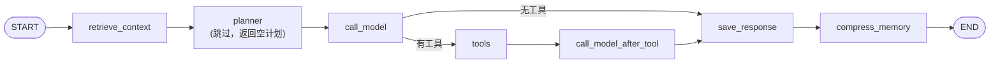

---

## asyncio 并发架构（核心优化）

### 旧版 vs 新版对比

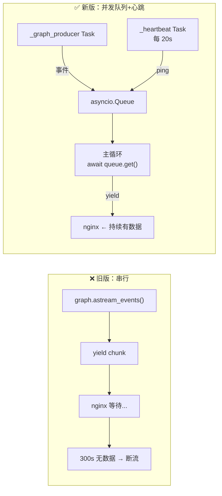

### asyncio 三个角色详解

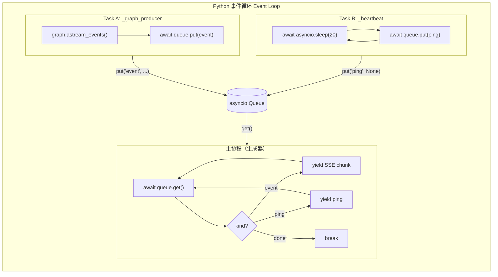

### 客户端断开时的清理流程

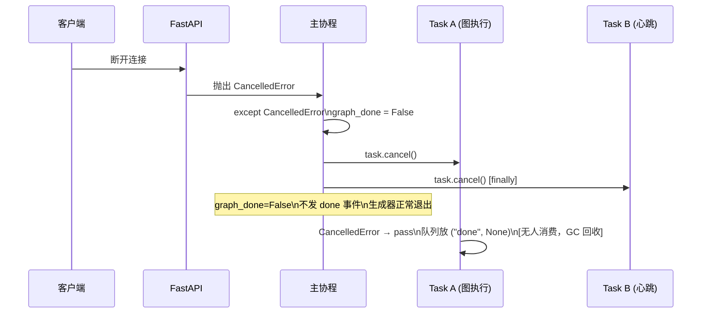

### 连接超时防线（多层）

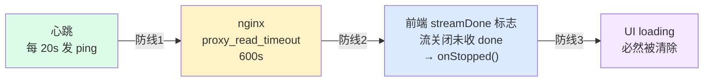

---

### stream_response 完整数据流

> 这是 `runner.py` 里最核心的函数，把 LangGraph 的事件流翻译成 SSE 字符串流发给浏览器。下面逐阶段拆解它的执行过程。

#### 阶段一：启动（函数入口）

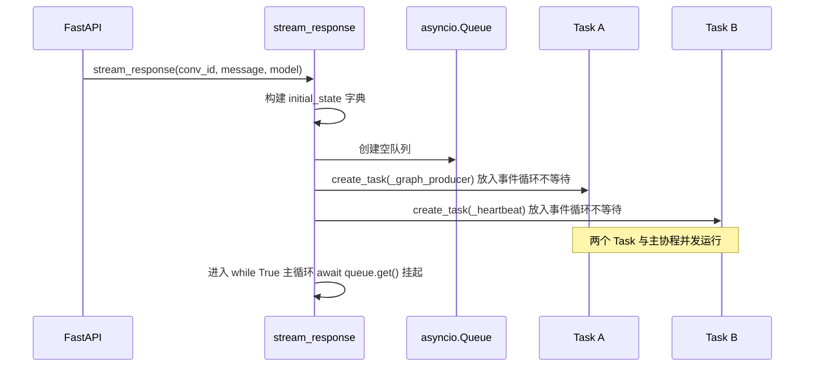

此刻三条执行流同时存在于事件循环中，谁有数据谁先跑。

---

#### 阶段二：正常执行期间的数据流

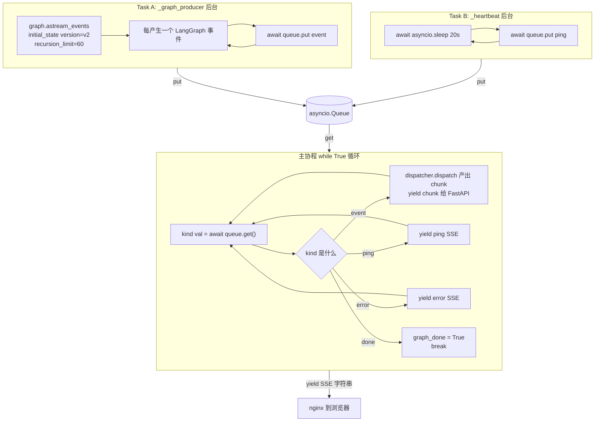

**关键细节**：
- `await queue.get()` 挂起时，事件循环切走执行 Task A / Task B
- Task A 的 `await queue.put()` 完成后，事件循环切回主协程继续 `get()`
- `yield chunk` 把 SSE 字符串交给 FastAPI 的 `StreamingResponse`，FastAPI 负责实际发送给 nginx

---

#### 阶段三：一个 LangGraph 事件如何变成 SSE 字符串

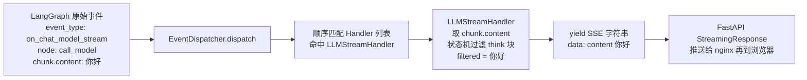

---

#### 阶段四：正常结束

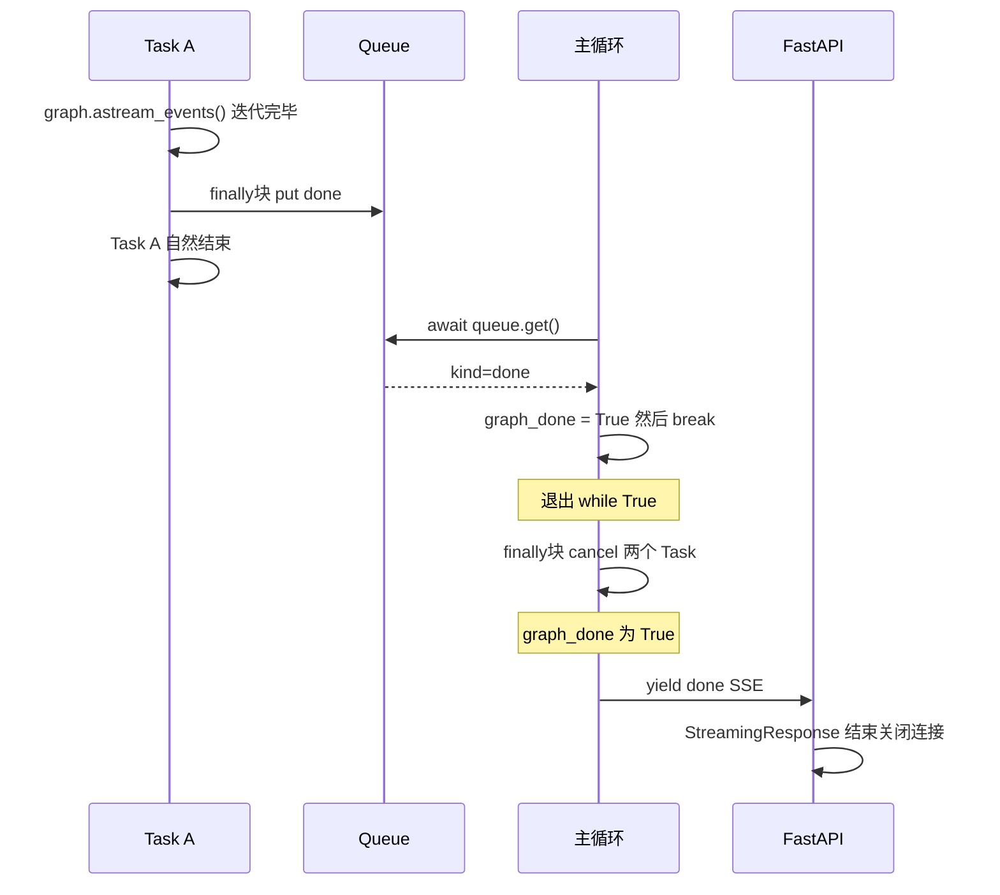

**`graph_done` 标志的作用**：区分「正常结束」和「异常断开」。只有正常收到 `("done", None)` 才发 `{"done":true}` 给前端，客户端断开走 `CancelledError` 时 `graph_done=False`，不发。

---

#### 阶段五：异常——图执行报错

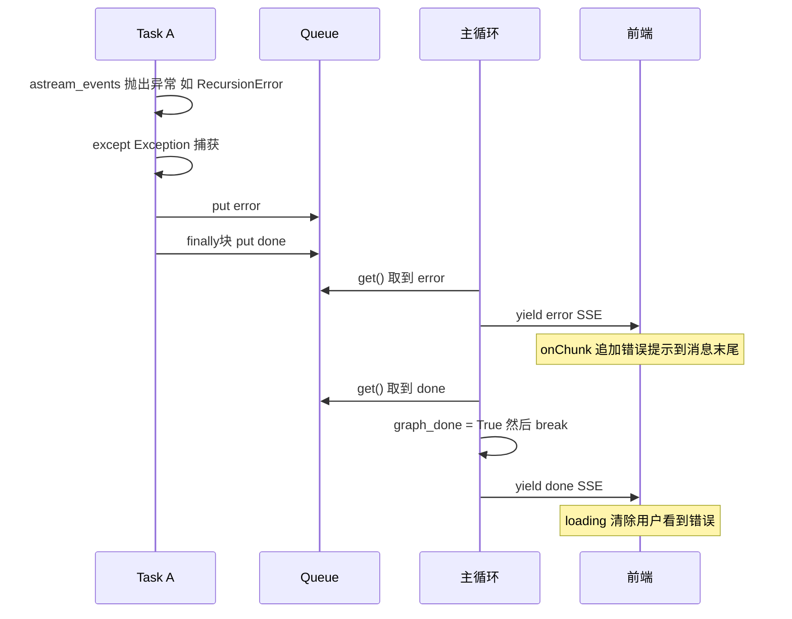

---

#### 阶段六：异常——客户端主动断开

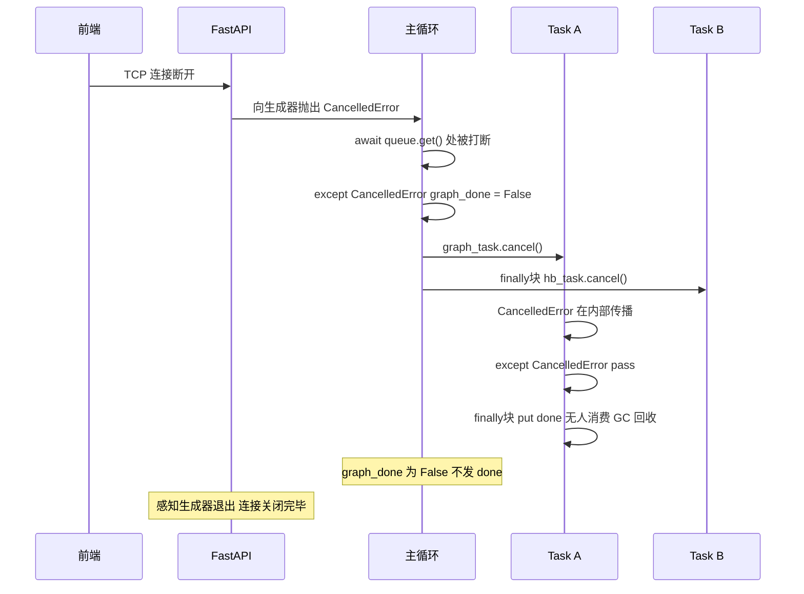

---

#### 状态机总览

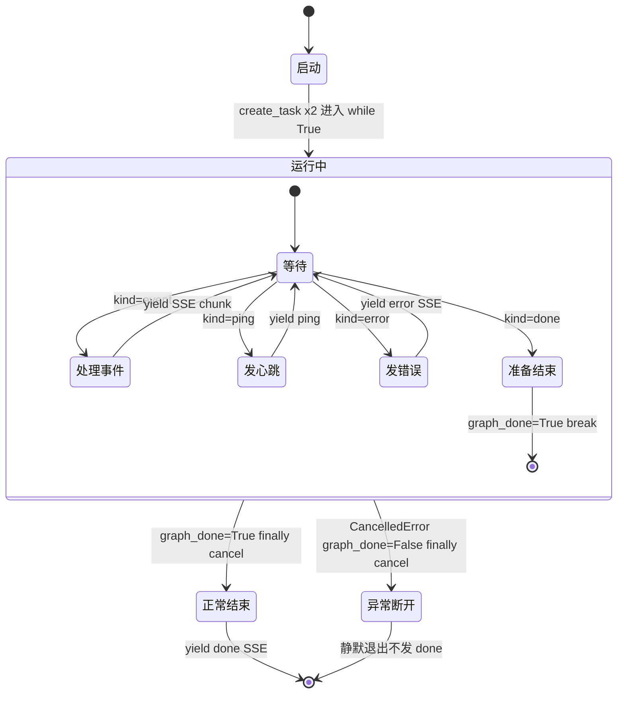

---

## SSE 事件处理链

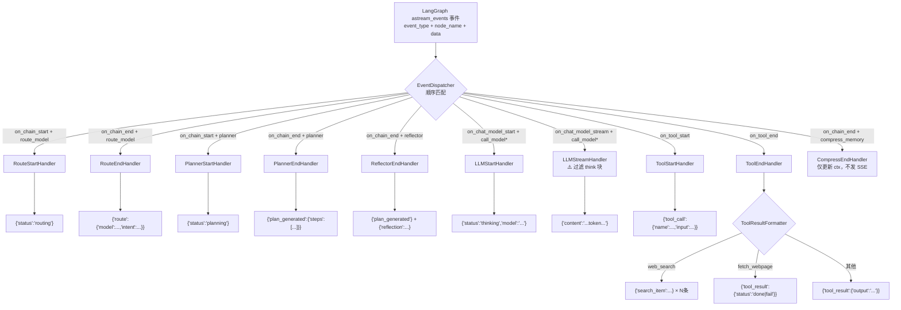

---

## think-block 三层过滤

qwen3 在 search/planning 模式下输出大量 `<think>...</think>` 推理内容，如果不过滤会导致 marked.js 误判代码块为文本（代码块没有预览按钮）。

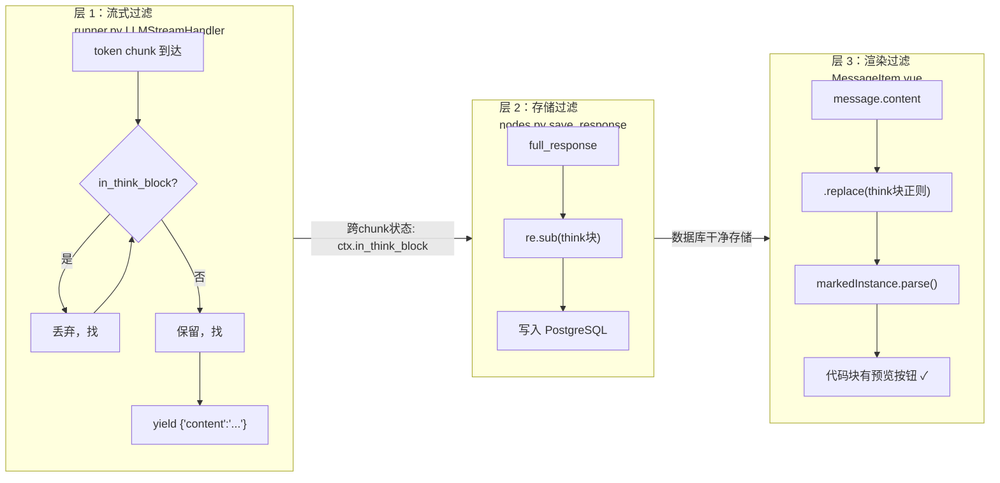

> **为什么要三层**：流式过滤基于 chunk 边界，边界刚好在标签中间时会有遗漏；存储过滤保证数据库干净；渲染过滤在浏览器端兜底，防止历史消息加载时残留块破坏 markdown 解析。

---

## 记忆系统

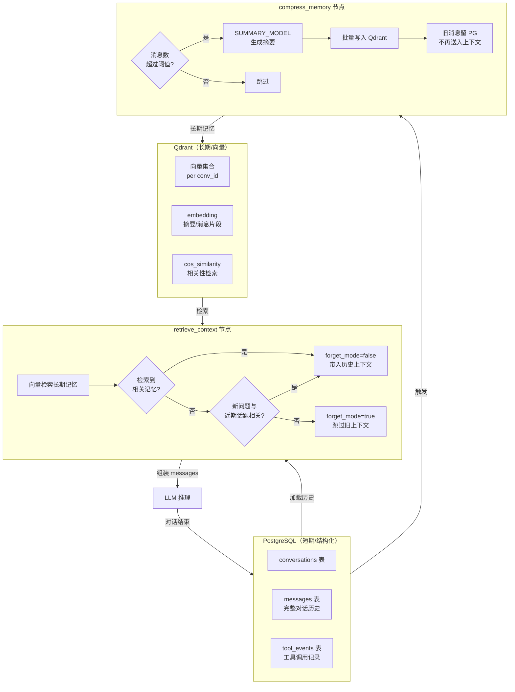

---

## 节点详解

### 路由决策表

| route | 触发场景 | tool_model | answer_model |
|---|---|---|---|
| `chat` | 通用聊天、推理、翻译、写作 | = answer_model | CHAT_MODEL |
| `code` | 纯代码编写/调试，需求明确 | = answer_model | CODE_MODEL |
| `search` | 需联网查实时信息，不写代码 | SEARCH_MODEL | SEARCH_MODEL |
| `search_code` | 查文档/仓库后再写代码 | SEARCH_MODEL | CODE_MODEL |

### reflector 决策逻辑

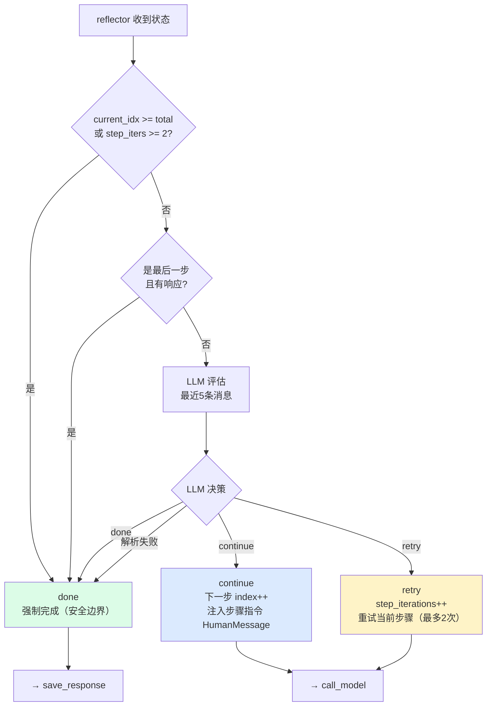

---

## 配置参考

| 环境变量 | 默认值 | 用途 |
|---|---|---|
| `CHAT_MODEL` | qwen3:8b | chat 路由 answer_model |
| `ROUTER_MODEL` | qwen3:8b | route_model 节点，temperature=0 |
| `SEARCH_MODEL` | qwen3:8b | search 路由 tool_model |
| `SUMMARY_MODEL` | qwen3:8b | compress_memory 摘要生成 |
| `EMBEDDING_MODEL` | bge-m3 | Qdrant 向量化 |
| `ROUTER_ENABLED` | true | 是否启用 route_model 节点 |
| `LONGTERM_MEMORY_ENABLED` | true | 是否启用 Qdrant 长期记忆 |
| `LLM_BASE_URL` | `http://host.docker.internal:11434/v1` | Ollama OpenAI 兼容 API |
| `recursion_limit` | 60（硬编码） | LangGraph 节点执行上限，支持 13 步计划 |
